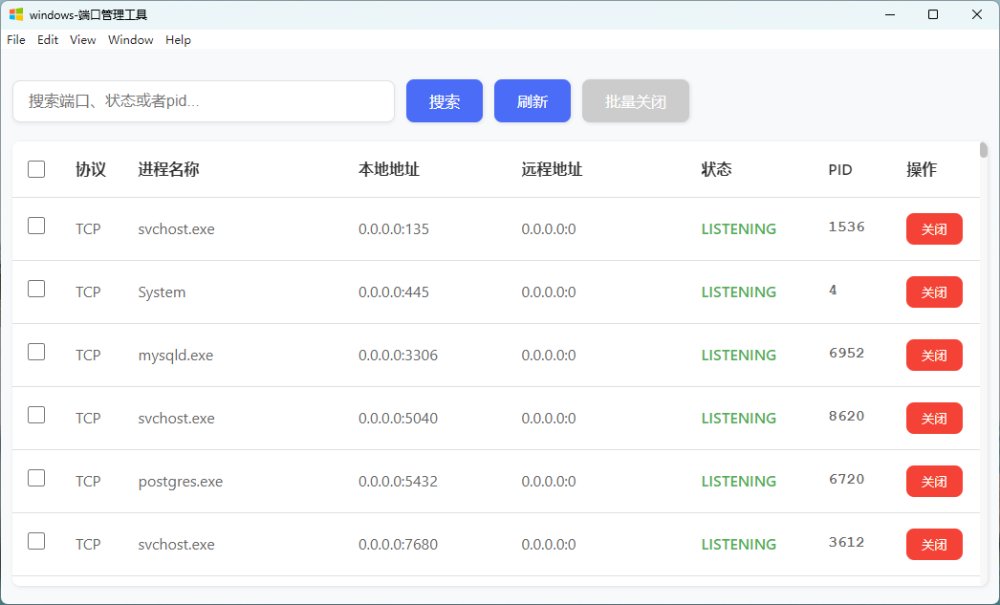

[English](README_EN.md) | [中文](README.md)

# Windows Port Management Tool 🛠️

A simple and practical Windows port management tool focused on **closing ports**💥, **searching ports**🔍, and **displaying port lists**📊, helping users quickly manage and optimize system ports.

## Features
- **Close Ports**💥: Supports batch selection of multiple ports and one-click closure, improving operational efficiency and resolving port conflicts or security issues.
- **Search Ports**🔍: Quickly search by port number to precisely locate target ports.
- **Port List**📊: Clearly displays all port usage in the system, including port numbers, status, and process information.

## Usage
1. **Run the Tool**🚀: [Download and run the exe file](https://gitee.com/ilovesshan/win-portkill/blob/master/exe/windows-%E7%AB%AF%E5%8F%A3%E7%AE%A1%E7%90%86%E5%B7%A5%E5%85%B7%20Setup%201.0.0.exe) for quick installation.
2. **View Port List**👀: After launching the tool, you can view a detailed list of all ports in the system.
3. **Search Ports**🔍: Enter the port number in the search box to quickly locate target ports.
4. **Close Ports**💥: Find the port you need to close and click the "Close" button.
5. **Batch Close**📝: After selecting multiple ports, click the "Batch Close" button to close multiple ports at once.

## Screenshots

## Notes
- It is recommended to run the tool with administrator privileges🛡️ to ensure ports can be closed normally.
- Closing ports may affect the operation of related applications, please operate with caution⚠️.

Hope this tool helps you efficiently manage Windows ports! 👍

